## Re-imagine JS and React Development

---

# Who is this guy?

* ~~Gabriel Chertok~~ Cherta
* Works @ [Ingenious](http://ingenious.agency)
* ~~COO~~ Does not code at all

---

## What's ReasonML and why I should care

---

> # Statically-typed functional programming language that compiles to JS
 
> # A new syntax for OCaml + toolchain to compile to JS

^Let's explore the definitions

---

---

# Functional

^ReasonML is a functional programming language that means it **defaults to immutable data structures** and it has **functions as the main abstraction**.

---

# Statically typed

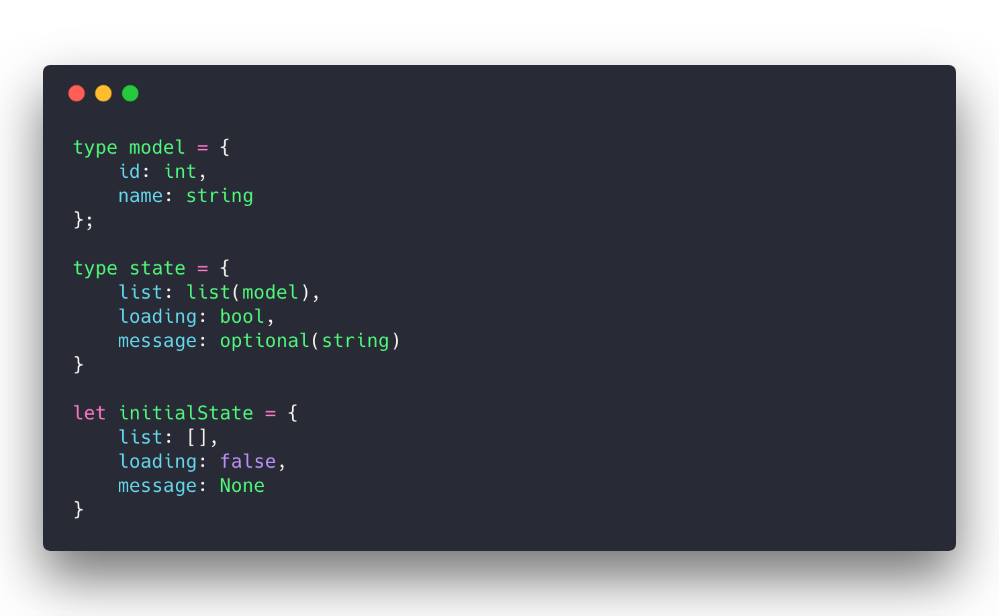

^Like some other languages functional programming languages in ReasonML you can **describe your types while coding and not at runtime**.

---

# Sound type system

^ReasonML has a sound type system, this means that **100% of your code is type checked** and types are guaranteed to be what you wrote.

^Having a great type system is useful not only to guarantee types but also to rely on it to do common tasks better.

---

# Type inference

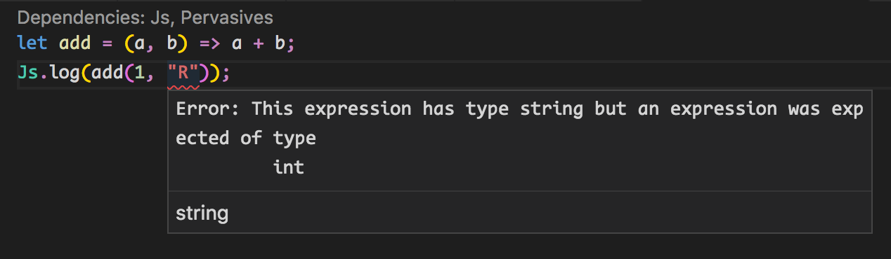

^In ReasonML you don't need to explicitly right every type to make the program compile, it will **infer most of your types out of the box** by following your program.

---

# Expressive type system

* Variants
* Pattern matching
* Type arguments

[Don't forget to show this sample code cherta](https:/.github.io/en/try?rrjsx=true&reason=C4TwDgpgBAlgJlAvLAdsA3AKFJKBbAezggBskoBvTKWOAGmqhQEM8IAuKAZ2ACcYUAcwYBfLNnDRmAY2AwCKJIwA+UAMK8IzYBBVQAqmDjbdNVQGUArtOkQuXABSFiJAJR6AIqQg7P3nVY2do7wruI40Dwm5FQ0JDA8nPE8TkSkrgxxBMxwAoKcAEYEBCSZ+MHMghxQBGByCg48-EIZmGKYmCQ+qDByzCTmwNHIFMnAnADaALp0UCTZuUKcAGb9XBCzbPaV1QByChDtnd2acNbQyI1DOrMy9SiuSAB8jFwA7r3SABZQDnfyD0oekCtnsqRcj0QTyBNFhUAAdIiojdGHD5jk8is1htUbCxpNnKRZoj4ciIPCxjNcSI9BotL4zAYjCY-F0dM9KCSybN0Yt8lA+JZDqyfBAQcEHAB9UIcslQAD0ACooPtgFAQN0YHgwF02GgIAhFfLGEc2UwIG9BsNGKdzg4BL0YP0rTcoOKwRR4JwAIyzFhsTgAIi8ADdSLUoF4UGHeIGRK4wh0AFJcCkEQQOBwoC0u8ljKDKaEAGQSwHhXzgrnh-ogiaAA)

^The expressiveness can be just a matter of taste but for me this way of expressing types is much better than the type systems I'm used to working with.

^And this expressiveness allow us to make things like pattern match and destructuring pretty easily.

---

# Close to JS syntax

^ReasonML reads like JS, this is clearly an **advantage** at least from me **coming from a JS background**.

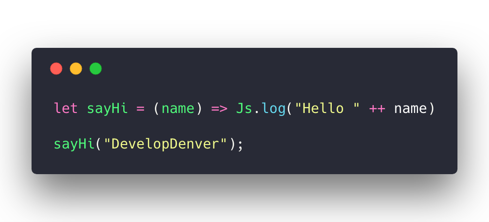

---

# Compiles to JS

^ReasonML compiles to js, well, not quite. ReasonML is a new syntax for OCaml, an old systems language and it shares pretty much everything but the syntax with OCaml.

^ReasonML will compile to the OCaml AST and a sister project, BuckleScript does the translation to JS land.

---

# BuckleScript

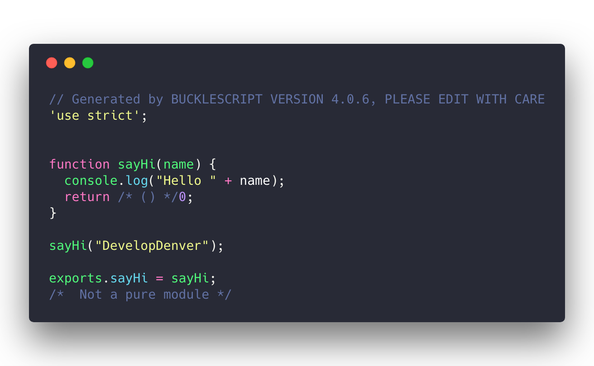

^BuckleScript compiles to JS the OCaml AST in a very particular way. First it outputs readable code like the one we are looking at and secondly it generates 1 bs.js file per .re file. This is great if we need for some reason to touch the generated code.

---

## Why should I care

^Let's say **you are sold on types**, that you feel types reduce the number of runtime errors and that it increases the confidence you have of the product you are shipping. Let's agree types are something you want to have.

^Why should I look into ReasonML instead of doing **TypeScript or PureScript, or Flow, or elm**. That's a great question.

^Of course there are other options and very good ones as well. For me what I love about ReasonML is that it **makes the right concessions**.

^For example **Elm makes it difficult to work outside the Elm garden and that's by design**. The Elm team thinks that if you always use Elm packages for everything you will have **0 runtime exceptions and they live up to that promise** but sometimes you do want to sacrifice some of that in order to get something done.

^I'm not saying you can't get things done with Elm or with PureScript, I'm just saying that it **needs more commitment** from more people to have it done.

^On the other hand you have languages or tools like **TypeScript of Flow that allow you to type your code gradually** but again, this falls way behind the other side of the line where **the type system it's easy to bend** to get something done now and most importantly recover from that is not always obvious.

^ReasonML and OCaml take a different approach, **you write 100% functional code in ReasonML** and you can either interact with JS on ReasonML thru what's called **BuckleScript directives** or you can also consume your generated JS code from other JS modules and this is thanks to BuckleScript being very clear on what gets out on the generated code and the generated code being really really nice.

---

# Side effects

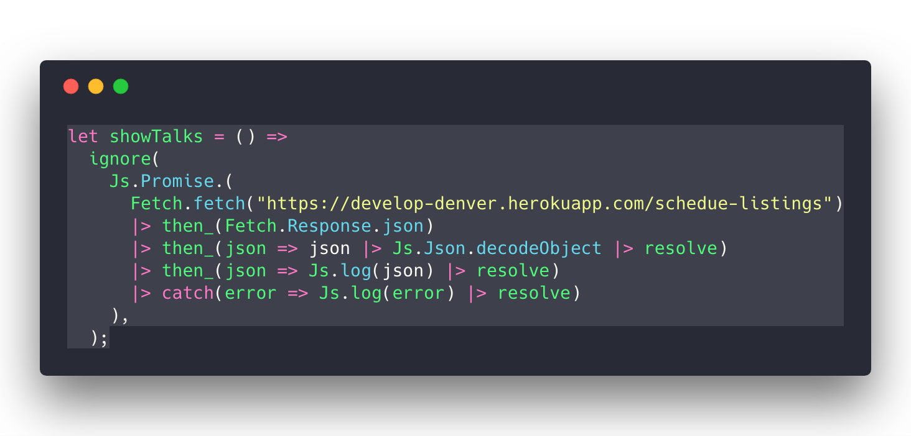

^Side effects are always complex in functional programming languages like ReasonML because **there's no guarantee on what will happen after the side-effect finishes**. It can be a call to a server or requesting a file from the disk, these operations need to be managed in a world where runtime exceptions are avoided like the plague and for a very good reason.

^I think ReasonML does a great job letting you be as specific as you want with doing this kind of tasks from allowing you to write them in JS completely to more secure things like decoding/encoding json that comes from the wire.

---

# npm ftw

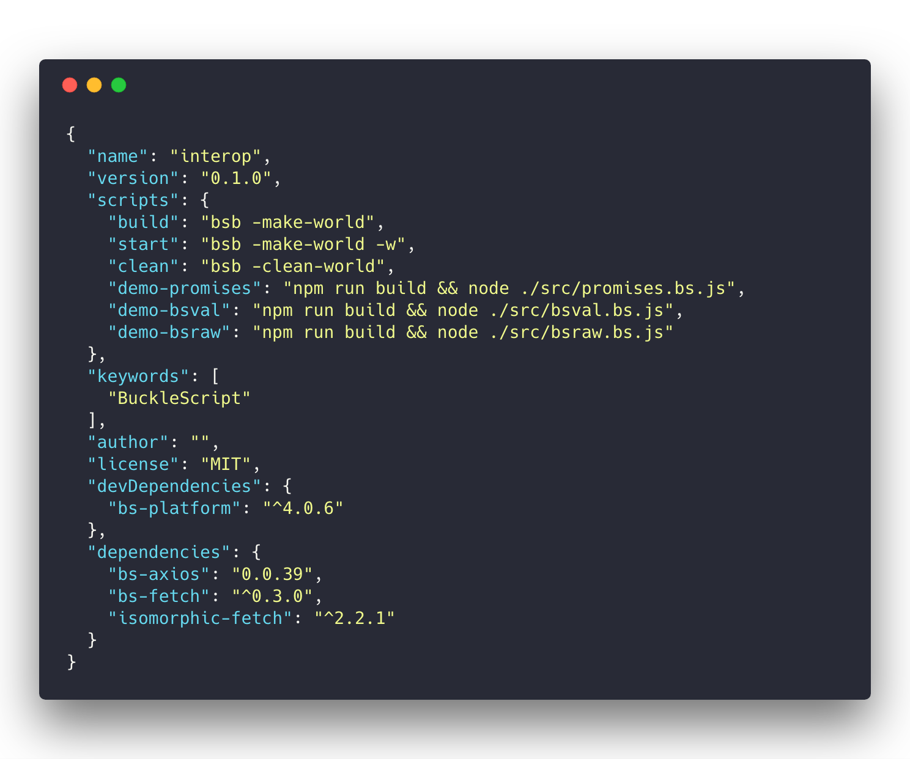 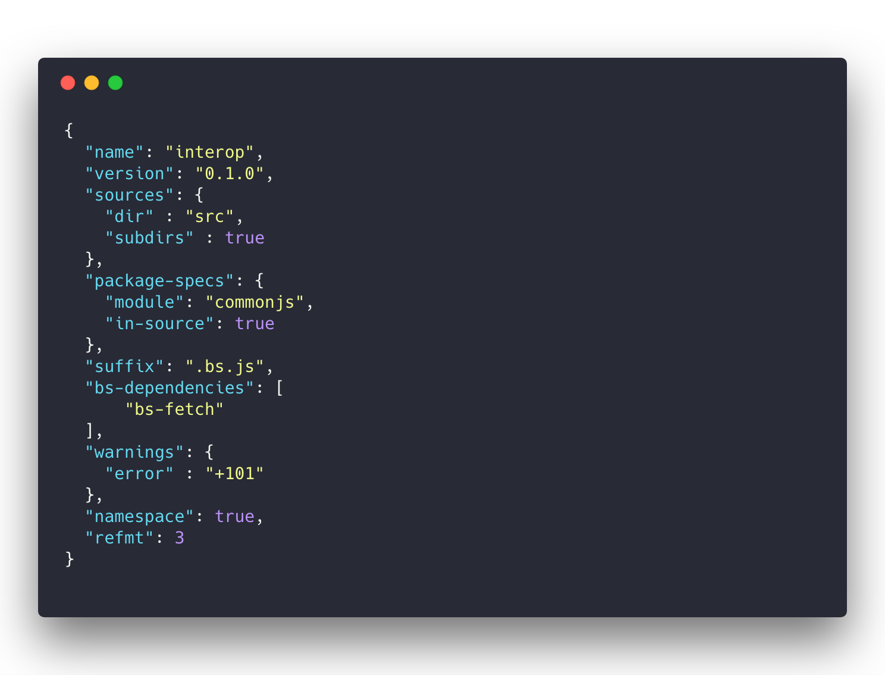

^ReasonML package manager is npm, this is something good since I don't need to learn new things to start coding with ReasonML. The only difference is that I need a bsconfig.json file to let ReasonML know which packages he should care about and which other packages are part of my regular JS development.

---

# bs.raw

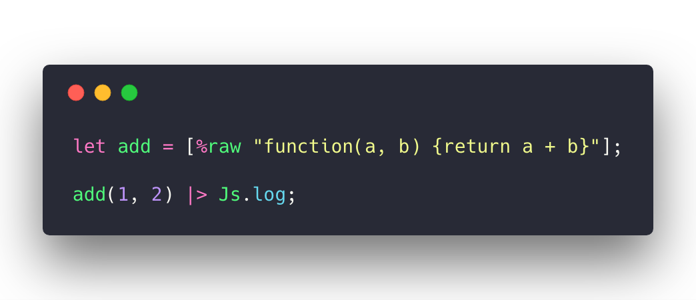

[sample](https:/.github.io/en/try?rrjsx=true&reason=DYUwLgBAhgJjEF4IG0CkAnKB3CAiAZgK4B2AxmAJYD2xAFFADQQBGAlBAN7riHrHQQA1CwC+uALoBuAFCwYtAIxMATOwA+APggApAM4A6YFQDmMoA)

^As you can see **if everything fails or if you want to really avoid REasonML and use JS instead** you can use the bs.raw directive and that will transpile to JS as is. The good thing is that it will do what's expected in terms of returning the values.

^The bad part is that the **type system wont be able to tell what's in there** and basically allow you to do whatever but there are some nicer directives we can use to make sure we are still typed while using JS code.

---

# bs.val

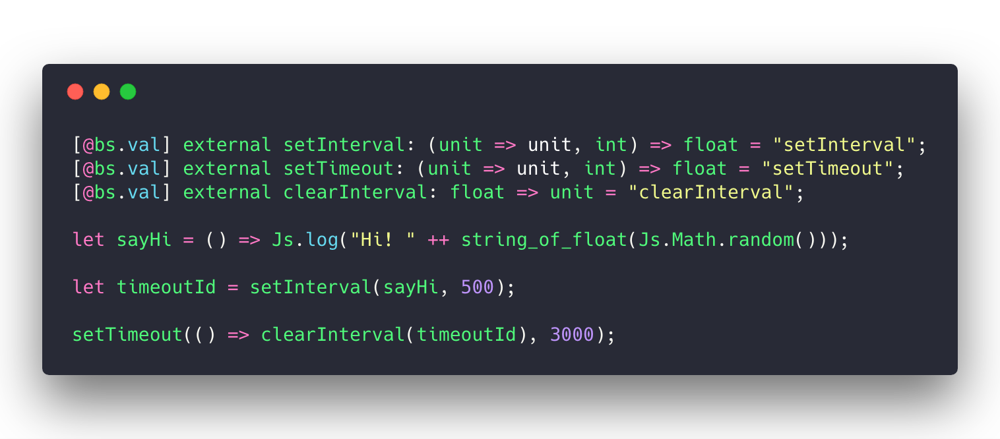

^To avoid this problem we can use bs.val to declare values that live outside the ReasonML world but you know they will be there and **keep working with types** and keep having all the goodies the type system has.

[sample](https:/.github.io/en/try?rrjsx=true&reason=NoAQRgzgdAbghgGwLoAICmAPALmgTgO0RQjSwEl8dd4EAuFACgFd8BLLFAXgD4UX2ANClaUAlF14AzBAHs4HTigBEJcpTw0lAbgBQoSLESpMVQgmKkAKqwC2aGUyz1mbBb35YhIrOJ4ppcgrKqtZ2DljaeuDQNMbYeGYoAMYIaHC4FFQ09AHyEnyuXMopaRnq1IiROqkcEHAAngASrEUMvrwAUtCyAOYMSs0AhMooANSjxFi4Ij0A+jKSs7lYDF1QALLyABZQuHD4ACYyNm2iorrVpChYtvaOZAdFqpkaiAx1TaxCAKwADL-nHQ6EK3cIMNr5ErpF4VBAMG5he4HURCADM-wBWiAA)

---

# bs.module

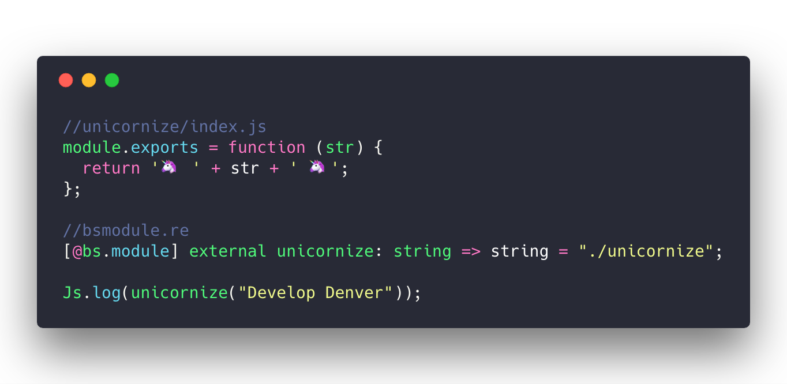

^Similarly you can use bs.module directive to bind local and npm modules using the same external we saw for bs.val.

---

# Bindings

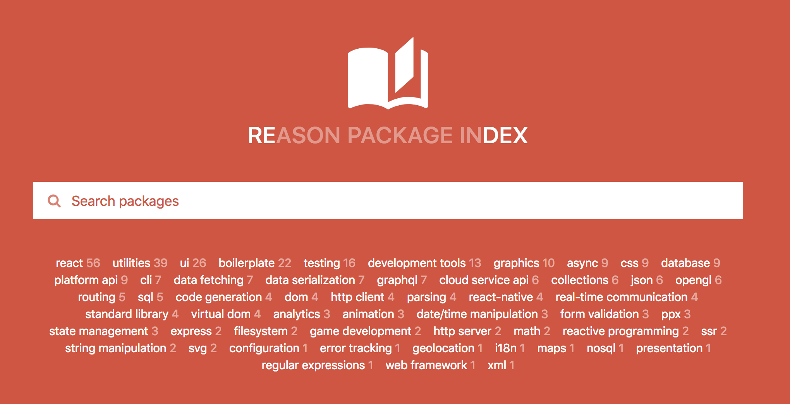 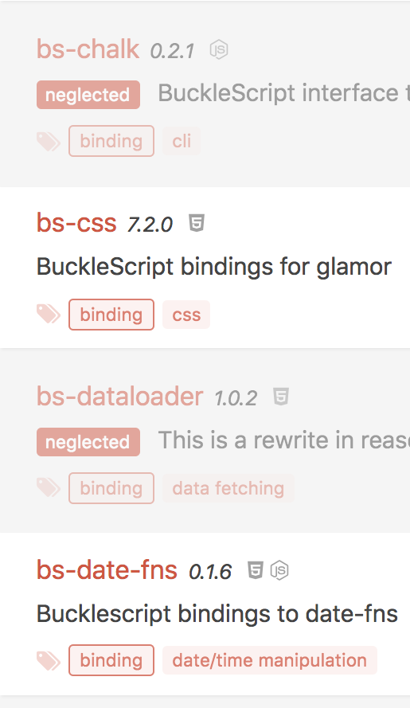 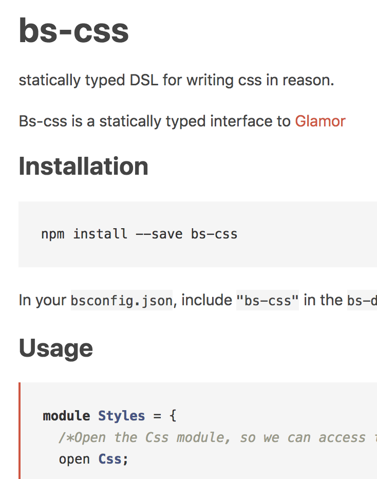

_https://redex.github.io/category/binding_

^When the task is typing a whole dependency, probably what we are looking for is for bindings.

---

# ReasonReact

^ReasonReact is not a React binding for the React library but actually a framework that can interop with React and leverages the ReasonML type system.

---

^Labeled arguments => option('a)

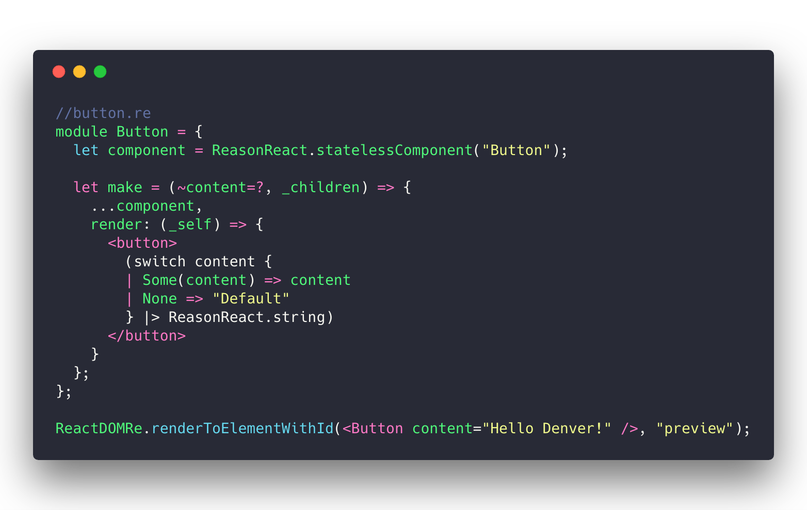

[ReasonReact Sample](https:/.github.io/en/try.html?rrjsx=true&reason=LYewJgrgNgpgBAIQgF2SAdnAvHA3gKDjlmTgGMRgAHDGdUnAJRgEMBnDZls5AOjeQtkMWGzYBhSjXR1kACgBESVBgUBKANz5CxGKWAsA1vBxyAfhXqysAfgA0cAPpkAFgEsoYAE5012AHx4OkS8oRTUtPR2wXA+6GAwXgBccHKObCIAZn5YgQREBXAAPABGKGjo-jGFcmwA7m7IruQYwvRBhYUAPnAAypQwcpZtyDmBw7LVBT0AcrQBcAoAIjCZLNDIClNEAL5wXYFcHOhcPPzIXm7oAOZqU0UA9GUqlTE7Ojtan9qnyEsA8gBZZi8OIJLwAFRAAFFYMBZAB1RouACSYDkRWUFRaVnoWAUAAkRFAQHAVugAG6JACECjgD38DgUVB8FLcMDq6g0QA)

---

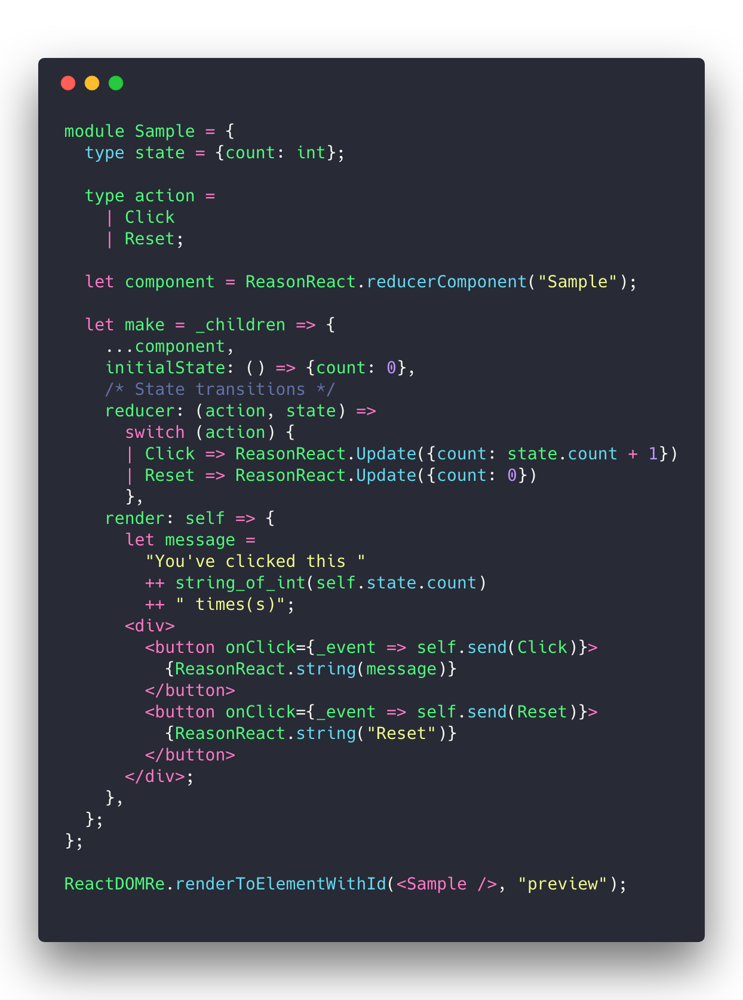

[ReasonReact Sample](https:/.github.io/en/try.html?rrjsx=true&reason=LYewJgrgNgpgBAZQIbAA6zgXjgbwFBxwD0AVIgC5LnxgwDGUSATlQJYgB2cJRBc5AT1TwAzpWpZcfQnRAQO5AFxxWCgDTS4IgBYgA7soBGIEFA2EAvgG48fUnACCdcuy60GzNp269Cg4XBIzq5YmgA+cADCUKx0ANbhcAAqIADmqbA2dmSRIGicMAr8MGiMEu6MLC6cAHSacAByMDBgIvwgcIbwJCRIAGbUTD1a4vBIHGCBwd4VntUcIgCEPnyw5HCy+RyF69gASjBIIpwHQeQ1TC0QdDBMuVs7ABQARACiAB4o6DDPAJRZhHsqUuMBcHFSgQmG20rCgYEuXGY8FQTBAqBENTgAAM6DC4QisSoRBwAOTrCAiFpqfjaW4wPogS4qVIcRktOqETkAdXgrBZbJU60MAjgKJgwgmqghrHWehl2khcHktCYIlkTJ4q1BcGASDi8GwjwAfsDmmDUtSAPq42Hwwq-LAAPiknOIZBEYqQk3ItLgIB9tzgtD6SGg6z6rBgcLaID6GzyqAKRVpTPGkxAADdbkxWLRAnA+jA9CtXTUy5tE9t1JpVDLWEgoAhRspHg7MM6cLJ5Eo4AAGak6fTKchMCAwCzmTn2JtUeAj8YiOucNqa12XSA3Jgts6uAejNuO+paOXkXFwR47zgO-CuwgRaKxOJOuCnY4cU7OGoAVVQYFnjxwMsajEWdqS7BRlBA6ganA9YAGo4AARgsX4jwiFJ0gwdsX0ON8P3OH8-2oACgKgmAB10Aw4EWMjgMolCjwnTQERVSCozjbCb1vNYdRgEQRCQVIDSPQhngATTkEksw2GJ4haGlWDaZ4RLgOCELEHNwUtWNLVUchHkpKA+mA0YYLkBRUNvTk1LgZ5+FYYA+IM35nhsKyAB4wFYDNDyswh3MMCByHIbxOAfeJMBwS0YCzIpsMM4zKQmR5wriX4LF8vzCBwV8TkOT8NKlR5HP4wSYHSlT3KIQLgs4TKPJqkKuDC2S4ki6LYt2Z0EuAwowEeDCMnKjKVOy3L33y85CvBF5BowU1QSlP4LEq6qgqa+rbxwHraMHYsAH4cKOPKzhMzTUkeBbzQdZRxvwmoOGgKAVo8ogvJ8tzOSYywbGsWx8IAEQAeQAWQOC4+tuFJXlgRyFC5eUAEl+r4dzkFKeArqlTBngACSjKAOgBwosyYRY7KIR1J2eMUM0jPRng0f48CAA)

---

## Demo time

---

# Conclusions

---

# Thank you

---

# Credits:

* _Photo by [Markus Spiske](https://unsplash.com/photos/C0koz3G1I4I?utm_source=unsplash&utm_medium=referral&utm_content=creditCopyText) on [Unsplash](https://unsplash.com/search/photos/lego?utm_source=unsplash&utm_medium=referral&utm_content=creditCopyText)_
* Dr. Axel Rauschmayer [Exploring ReasonML and functional programming](http:/hub.com/exploring-reasonml/ch_about-reasonml.html) book
* _Photo by [Craig Sybert](https://unsplash.com/photos/S-vkpXA3os8?utm_source=unsplash&utm_medium=referral&utm_content=creditCopyText) on [Unsplash](https://unsplash.com/search/photos/geek?utm_source=unsplash&utm_medium=referral&utm_content=creditCopyText)_
* _Photo by [Markus](https://unsplash.com/photos/68ZlATaVYIo?utm_source=unsplash&utm_medium=referral&utm_content=creditCopyText) Spiske on [Unsplash](https://unsplash.com/search/photos/tech?utm_source=unsplash&utm_medium=referral&utm_content=creditCopyText)_
* _Photo by [Kyle Johnston](https://unsplash.com/photos/NaG0G9Wi7nI?utm_source=unsplash&utm_medium=referral&utm_content=creditCopyText) on [Unsplash](https://unsplash.com/search/photos/sound?utm_source=unsplash&utm_medium=referral&utm_content=creditCopyText)_
* _Photo by [Ozan Safak](https://unsplash.com/photos/qSUZjIEdhmU?utm_source=unsplash&utm_medium=referral&utm_content=creditCopyText) on [Unsplash](https://unsplash.com/search/photos/ballet?utm_source=unsplash&utm_medium=referral&utm_content=creditCopyText)_
* _Photo by [Hal Gatewood](https://unsplash.com/photos/OgvqXGL7XO4?utm_source=unsplash&utm_medium=referral&utm_content=creditCopyText) on [Unsplash](https://unsplash.com/search/photos/atom?utm_source=unsplash&utm_medium=referral&utm_content=creditCopyText)_
* _Photo by [Victor Rodriguez](https://unsplash.com/photos/pWOdBS_l9LQ?utm_source=unsplash&utm_medium=referral&utm_content=creditCopyText) on [Unsplash](https://unsplash.com/search/photos/jump?utm_source=unsplash&utm_medium=referral&utm_content=creditCopyText)_
